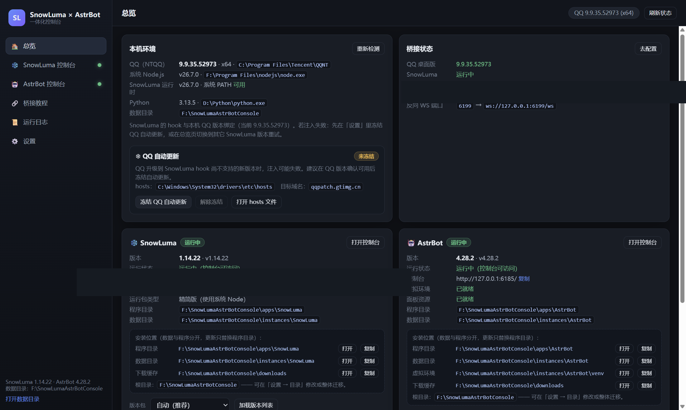
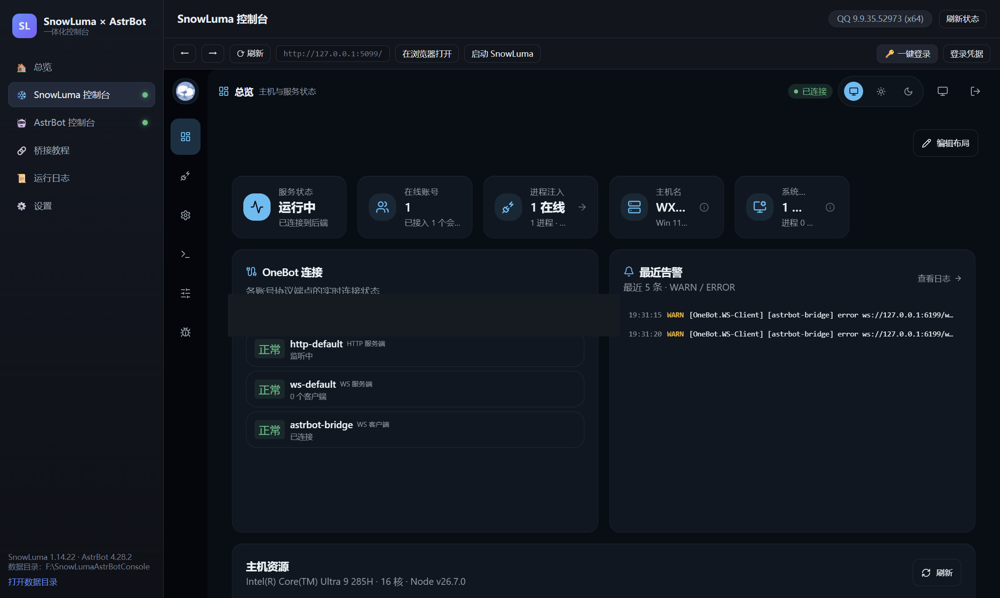
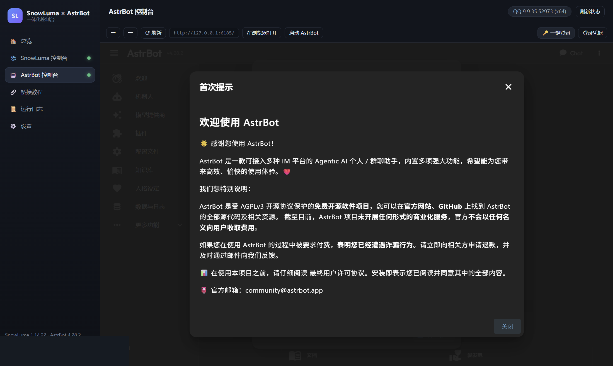
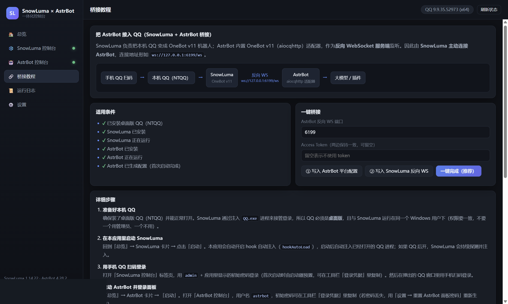
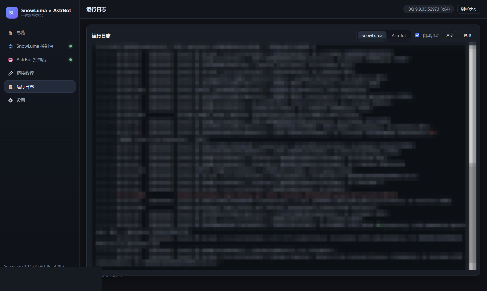

# SnowLuma × AstrBot 控制台

一个 Windows 桌面应用（Electron），把 **SnowLuma**（本机 QQ → OneBot v11）和 **AstrBot**（LLM 机器人框架）收进同一个窗口：

- 一键下载 / 安装 / 启动 / 停止 / 更新两者，**全程不弹出任何终端控制台窗口**；
- 两个项目的 WebUI（SnowLuma `5099`、AstrBot `6185`）**直接内嵌在应用里**，不用再开浏览器，登录还能**一键完成**；
- AstrBot 更新会**保留原有数据**（配置、插件、数据库、会话记录全在 `data/` 里，更新只替换程序代码）；
- 本机没装时显示「下载安装」，按本机环境自动选择版本（SnowLuma 会按平台/架构/Node 情况选精简版或内置 Node 的完整版，并展示本机 QQ 版本与 hook 兼容性提示）；
- **应用内冻结 QQ 自动更新**：读取 hosts 当前状态，一键冻结/解除（只弹 UAC，不弹终端）；
- 内置 **SnowLuma ↔ AstrBot 桥接教程**，并提供「一键桥接」直接写好两边的 OneBot 反向 WS 配置。



---

## 一、快速开始

### 方式 A：用安装包（推荐）

运行 `dist-installer/SnowLumaAstrBotConsole-Setup-1.0.0.exe`（NSIS 单文件安装包，自带图标，可选安装目录、创建桌面/开始菜单快捷方式，卸载**不会**删除 SnowLuma/AstrBot 的数据）。

生成安装包：

```powershell
npm run icon     # 生成 build/icon.ico（多尺寸，7 档）
npm run dist     # 产出 dist-installer/SnowLumaAstrBotConsole-Setup-<版本>.exe
```

### 方式 B：免安装绿色版

```
dist/SnowLumaAstrBotConsole-win32-x64/SnowLumaAstrBotConsole.exe
```

双击即可，不依赖 Node/npm（若目录不存在，先在仓库根目录执行一次 `npm install` 和 `npm run pack`）。

### 方式 C：源码运行

双击仓库根目录的 **`启动控制台.cmd`**（首次会自动 `npm install`，约 1~2 分钟），或手动执行：

```powershell
npm install
npm start
```

> 若你的终端环境里存在 `ELECTRON_RUN_AS_NODE=1`（某些 Electron 宿主会设置），必须先清掉它，否则 Electron 会以纯 Node 模式运行而报 `app.getPath is not defined`；`启动控制台.cmd` 已经帮你处理。

启动后：

1. **总览**页看到「本机环境」（QQ 版本、Node、Python、数据目录）；
2. 点 SnowLuma 卡片的 **⬇ 下载安装**（默认精简版，本机已装 Node ≥ 22.13 时约 5 MB；否则用完整版）；
3. 点 AstrBot 卡片的 **⬇ 下载安装**（下载源码 + 创建 venv + 安装依赖，依赖较多，通常 3~10 分钟）；
4. 点 **▶ 一键启动全部**（也可以在设置里开启「应用启动时自动拉起」，之后打开应用即可）；
5. 侧边栏 **SnowLuma 控制台** / **AstrBot 控制台** 就是两者原本的 WebUI，点工具栏 **🔑 一键登录** 即可进入；
6. 按 **桥接教程** 页的步骤把 AstrBot 接到 QQ（含「一键桥接」）。






> 文档里的截图取自真实运行环境，涉及个人账号（QQ 号/昵称）与群消息的区域已做遮盖处理（打码脚本见 `tools/redact-shots.py`）。

### 方式 B：打包成免安装 exe

```powershell
npm run pack        # 产出 dist/SnowLumaAstrBotConsole-win32-x64/SnowLumaAstrBotConsole.exe
```

双击生成的 exe 即可（不再依赖 Node/npm，也不再需要 `启动控制台.cmd`）。

---

## 二、首次使用流程（接 QQ 的完整链路）

```
手机 QQ 扫码 → 本机 QQ(NTQQ) → SnowLuma(OneBot v11) --反向WS--> AstrBot(aiocqhttp) → 大模型
```

1. **装好桌面版 QQ（NTQQ）** 并保持能正常打开。SnowLuma 是通过注入 `QQ.exe` 进程工作的；
2. 应用里启动 SnowLuma（默认已开启 `hookAutoLoad`，会自动发现并注入 QQ 进程）；
3. 在「SnowLuma 控制台」里用 `admin` + 登录凭据登录，然后用手机 QQ 扫码；
4. 启动 AstrBot，在「AstrBot 控制台」里用 `astrbot` + 登录凭据登录，并在「服务提供商」里配好模型 API Key（否则收到消息也不会回复）；
5. 打开 **桥接教程 → 一键桥接**：
   - 写入 AstrBot：`OneBot v11` 平台 → 反向 WS `127.0.0.1:6199`（并自动重启 AstrBot 生效）；
   - 写入 SnowLuma：`config/onebot.json`（以及已登录账号的 `config/onebot_<uin>.json`）新增反向 WS 客户端 → `ws://127.0.0.1:6199/ws`；
   - 完成后重启一次 SnowLuma（应用会提示，也可直接点「重启」）；
6. **验证**：AstrBot 日志出现 `aiocqhttp(OneBot v11) 适配器已连接。`；用另一个 QQ 给机器人发 `/help`，有回复即成功。

---

## 三、目录结构（程序与数据分离）

默认数据根目录：`%APPDATA%\SnowLumaAstrBotConsole\data`（可在「设置 → 目录」里改，或用「迁移数据目录…」整体搬到别的盘，例如 F 盘）

```
<数据根目录>/
├─ apps/                     程序代码（更新时整体替换，不含任何用户数据）
│  ├─ SnowLuma/              index.mjs、native/、client/ …（精简版用系统 Node，完整版自带 node.exe）
│  └─ AstrBot/               main.py、astrbot/、requirements.txt …
├─ instances/                运行时数据（更新程序不会碰这里）
│  ├─ SnowLuma/              SnowLuma 的工作目录：config/（runtime.json、onebot*.json、webui.json）、data/、logs/
│  └─ AstrBot/               ASTRBOT_ROOT：data/（cmd_config.json、插件、data_v4.db、dist 面板）、venv/（Python 虚拟环境）
├─ downloads/                安装包缓存（支持断点续传的 .part 文件也在里面）
├─ logs/                     snowluma.log / astrbot.log（应用的「运行日志」页同源）
└─ state/                    各组件已安装版本等元信息
```

> **安装位置全程可见**：点「下载安装」前会弹确认框，逐条列出**程序目录 / 数据目录 / 虚拟环境 / 下载缓存**；两张服务卡片和设置页常驻显示同样的路径（带「打开」「复制」按钮）；安装/更新过程中的进度文字也会带上目标目录。

这样设计的直接好处：
- **更新 = 替换 `apps/` 下的代码**，`instances/` 里的账号、配置、插件、数据库完全不受影响；
- 出问题想重来，只删 `apps/` 即可，数据仍在；
- 换机器迁移，只拷 `instances/`（AstrBot 的 venv 建议重装依赖），或直接用下面的迁移功能。

### 把数据搬到别的盘（例如 C 盘 → F 盘）

「设置 → 目录 → 迁移数据目录…」：选目标目录 → 应用先做检查（数据量、目标盘剩余空间、服务是否在运行）→ 自动**停止服务 → robocopy 多线程复制 → 逐项校验文件数与总体积 → 删除旧目录 → 改写数据根目录 → 重建目录骨架**。校验不通过会保留旧目录并中止，绝不丢数据。

启动器自身那 ~30 MB（`settings.json` + 两个控制台的登录态 + Chromium 缓存）默认仍在 `%APPDATA%\SnowLumaAstrBotConsole`；想连它也放到 F 盘就用**便携模式**：在 `SnowLumaAstrBotConsole.exe` 同目录放一个 `portable.txt`，内容写目标目录（留空则用 exe 同目录的 `profile\`）。

---

## 四、实现要点

| 需求 | 实现方式 |
| --- | --- |
| 不出现终端控制台 | 主进程是 Electron GUI；所有子进程用 `child_process.spawn` + `windowsHide: true` + **不使用 shell**；直接调 `node.exe` / `python.exe`，不经 `launcher.bat`、`cmd.exe`；stdout/stderr 用管道接进应用日志 |
| 内嵌控制台 | `<webview>` 独立分区（`persist:snowluma` / `persist:astrbot`）加载 `127.0.0.1:5099` / `6185`，登录态独立保存；工具栏支持前进/后退/刷新/外开 |
| 一键登录 | SnowLuma：在登录页用原生 setter 填入密码并提交（已验证可用）；AstrBot：直接调 `/api/auth/login` 拿 JWT，再写入面板的 `localStorage`（token/user）并跳转 |
| 无终端也能看到日志 | 子进程输出实时进内存环形缓冲 + 落盘 `logs/*.log`，应用内「运行日志」页直接看，支持导出 |
| 首次密码可控 | SnowLuma：启动时用 `SNOWLUMA_WEBUI_BOOTSTRAP_PASSWORD` 预置已知密码，并从 stdout 兜底抓取 `initial credentials:`；AstrBot：首次启动前就在 `data/cmd_config.json` 写入与官方算法一致的 PBKDF2 哈希，密码由启动器生成并可随时查看/复制（丢失也能一键重置） |
| 更新保留数据 | SnowLuma/AstrBot 都是"程序目录整体替换 + 数据目录不动"；AstrBot 更新后自动重跑 `pip install -r requirements.txt` 同步依赖 |
| 国内网络 | 所有 GitHub 下载 **直连优先，失败自动切镜像**（`ghproxy.net` / `gh-proxy.com` / `ghfast.top`，可自定义）；断点续传 + 停滞 45 秒自动换源；pip 依赖默认走清华源，失败自动换阿里/官方源 |
| QQ 版本匹配 | 探测本机 QQ 安装路径/版本/架构（PE 头 + `versions/` 目录 + 注册表三重探测），据此选择平台对应的 SnowLuma 包；界面明确提示 hook 与 QQ 版本绑定，并提供历史版本回退 |
| 冻结 QQ 自动更新（应用内） | 应用内直接读取 hosts 状态（已冻结/未冻结/他人写入），一键冻结或解除：把 `qqpatch.gtimg.cn` 解析到 `0.0.0.0`（与官方文档一致，写入时保留原文件字节、只用 ASCII 标记块，避免编码损坏）。有权限时直接写；没权限时由一个隐藏窗口的提权进程完成——**只会弹 UAC，不会出现终端窗口** |
| 外部实例兼容 | 如果 5099/6185 上已经有别人（或上次残留）启动的实例，应用会识别为「运行中（外部实例）」并直接内嵌显示，不会重复拉起造成端口冲突 |

> 关于「按本机 QQ 版本下载对应 SnowLuma」：SnowLuma 官方**没有公开「SnowLuma 版本 ↔ QQ 版本」对照表**，它的 native hook 是按 QQ 版本对齐的，QQ 自动升级后可能不再兼容。因此本应用的做法是：探测本机 QQ（版本/架构）→ 选择匹配平台的发行包（Windows x64 / arm64，精简版或完整版）→ 在界面上展示 QQ 版本并提供「冻结 QQ 更新」和「切换历史版本重装」两条官方建议的处置路径，而不是硬编码一张可能过期的对照表。

---

## 五、端口与配置

| 端口 | 用途 | 可改位置 |
| --- | --- | --- |
| 5099 | SnowLuma WebUI | 设置 → 端口（写入 `instances/SnowLuma/config/runtime.json`） |
| 3000 | SnowLuma OneBot HTTP | 同上（读取 `config/onebot*.json` 里的 token 用于状态查询） |
| 3001 | SnowLuma OneBot 正向 WS | 同上 |
| 6185 | AstrBot 面板 | 设置 → 端口（启动时以 `DASHBOARD_PORT` 注入，并同步到 `cmd_config.json`） |
| 6199 | AstrBot 反向 WS（SnowLuma 连过来） | 设置 → 端口 / 桥接页 |

---

## 六、常见问题

**Q：为什么下载很慢或失败？**
A：国内直连 `github.com/.../releases/download/...` 经常超时。本应用会自动按顺序尝试镜像，并支持断点续传；若全部失败，可在「设置 → 下载源与镜像」里换成你可用的镜像前缀（形如 `https://你的镜像/`，后面会拼接完整 GitHub 地址）。

**Q：AstrBot 面板打不开 / 白屏？**
A：AstrBot 的面板静态资源是单独的 dist 包，官方 registry 有时不可用。应用会在安装/启动后尝试从 GitHub Release 拉取 `AstrBot-<版本>-dashboard.zip` 解压到 `instances/AstrBot/data/dist`；失败时可在「设置 → 修复 AstrBot 面板资源」重试。

**Q：AstrBot 依赖装不上？**
A：在「设置 → 修复 AstrBot 依赖」重试，或更换 pip 源。AstrBot 需要 Python ≥ 3.12（应用会自动挑 3.13 / 3.12 / 3.14）。

**Q：QQ 注入失败 / QQ 崩溃？**
A：① 先开 QQ 再开 SnowLuma；② 确认两者以相同权限运行（不要一个管理员、一个普通）；③ 在「总览 → QQ 自动更新」里点 **冻结 QQ 自动更新**（把 `qqpatch.gtimg.cn` 解析到 `0.0.0.0`，阻止 QQ 偷偷升级；需要管理员权限时会弹 UAC，应用本身不会打开任何终端窗口）；④ 仍不行就在总览页选择别的 SnowLuma 版本重装重试。

**Q：冻结 QQ 自动更新会不会改坏我的 hosts？**
A：不会。应用只在文件末尾追加一段带英文标记的块（`# >>> SnowLuma x AstrBot Console - freeze QQ auto-update >>>` … `# <<< … <<<`），原有内容按字节保留；解除冻结只删除这一段，绝不动你自己或其它软件写的记录。如果 hosts 里已经存在别人写的 `0.0.0.0 qqpatch.gtimg.cn`，应用会识别为"已冻结（他人写入）"且不会去改它。

**Q：安装包卸载后我的机器人数据会没吗？**
A：不会。安装包（NSIS）关闭了"卸载时删除应用数据"，卸载只移除程序与快捷方式，`%APPDATA%\SnowLumaAstrBotConsole\data` 下的 SnowLuma/AstrBot 程序与数据原样保留（已实测）。

**Q：停止服务会丢数据吗？**
A：不会。停止是结束进程（先温和 kill，2~4 秒后必要时 `taskkill /T /F` 清理进程树），SnowLuma 的配置是原子写入，AstrBot 用 SQLite WAL。退出应用时会自动停止两个服务，避免残留。

---

## 七、开发者备注

```powershell
npm start                     # 启动应用
npm run icon                  # 重新生成 build/icon.ico（Electron 渲染 SVG → 多尺寸 ICO）
npm run pack                  # 免安装绿色版 → dist/
npm run dist                  # NSIS 单文件安装包 → dist-installer/SnowLumaAstrBotConsole-Setup-<版本>.exe

node tools/selftest.js --only=env        # 只跑环境探测
node tools/selftest.js --only=snowluma   # 下载安装并启动 SnowLuma（无界面）
node tools/selftest.js --only=astrbot    # 下载安装 AstrBot（含依赖，耗时较长）
node tools/test-update.js all            # 验证更新链路：装旧版 → 更新 → 断言数据保留
node tools/test-qqfreeze.js              # 验证冻结 QQ 自动更新（纯逻辑 + 真实冻结/解除循环）
node tools/fix-state.js                  # 修复 SnowLuma OneBot 配置（补回出厂监听器 + 反向 WS）

# 自检用截图（不需要人工点界面，还能点按钮做端到端验证）
$env:SLA_SCREENSHOT_PAGES='home,snowluma,astrbot,bridge,logs,settings'
$env:SLA_AUTOLOGIN='1'                                   # 控制台页面先一键登录
$env:SLA_BEFORE_JS="document.querySelector('[data-act=install][data-svc=snowluma]').click()"
$env:SLA_BEFORE_WAIT_MS='140000'                         # 点击后等待安装完成再截图
$env:SLA_SCREENSHOT_DIR='.shots'
npm start
```

主进程模块划分（`app/main/`）：

| 文件 | 职责 |
| --- | --- |
| `index.js` | 窗口、IPC、服务编排、退出清理、截图自检钩子 |
| `settings.js` | 配置存储与目录布局（apps/instances/downloads/logs） |
| `net.js` | GitHub API、镜像回退下载、断点续传、SHA256 校验 |
| `unzip.js` | 流式 zip 解压（进度、防目录穿越、剥离顶层目录） |
| `proc.js` | 隐藏窗口子进程管理、日志缓冲与落盘 |
| `qqfreeze.js` | 应用内冻结/解除 QQ 自动更新（hosts 状态读取、字节级安全写入、按需 UAC 提权） |
| `migrate.js` | 数据目录迁移（计划检查 → robocopy 复制 → 文件数/体积校验 → 删旧目录 → 切换根目录） |
| `env-scan.js` | QQ / Node / Python 探测、PE 架构识别、内置 Node 定位 |
| `snowluma.js` | SnowLuma 检测/安装/更新/启停/状态/OneBot 配置写入 |
| `astrbot.js` | AstrBot 检测/安装/更新/启停/venv/依赖/面板/平台配置写入 |
